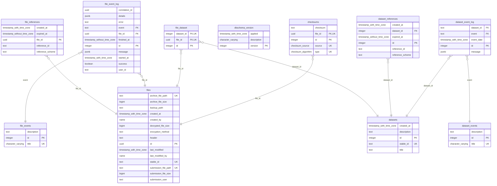

Database Setup
==============

A Postgres database (version 15+) is employed for storing intermediate data to track progress in file ingestion. The database schema, named lega, is documented below.

> NOTE:
> Source code repository for DB component is available at:
> <https://github.com/neicnordic/sensitive-data-archive/tree/main/postgresql>

The database container will initialize and create the necessary database
structure and functions if started with an empty area. Procedures for *backing up the database* are important, however considered out of scope for
the secure data archive project.

Refer to [the SQL definitions](https://github.com/neicnordic/sensitive-data-archive/tree/main/postgresql/initdb.d)
if an interest in the database triggers exists.

Configuration
-------------

Security is hardened:

- The 'trust' authentication method is not utilized, even for local connections
- Requiring password authentication for all
- Enforcing TLS communication
- Enforcing client-certificate verification

The following environment variables can be used to configure the database:

| Variable               | Description                         | Default value            |
| :--------------------- | :---------------------------------- | :----------------------- |
| PGDATA                 | Mountpoint for the writable volume  | /var/lib/postgresql/data |
| POSTGRES_DB            | Name of the database                | sda                      |
| POSTGRES_PASSWORD      | Password for the user `postgres`    | -                        |
| POSTGRES_SERVER_CERT   | Public Certificate in PEM format    | -                        |
| POSTGRES_SERVER_KEY    | Private Key in PEM format           | -                        |
| POSTGRES_SERVER_CACERT | Public CA Certificate in PEM format | -                        |
| POSTGRES_VERIFY_PEER   | Enforce client verification         | verify-ca                |

Client verification is enforced if `POSTGRES_VERIFY_PEER` is set to `verify-ca` or `verify-full`.

Database schema
---------------

The current database schema is documented below.

Database Functions
------------------

- `files_updated()` -  When there is an update, update the last_modified and last_modified_by fields on the files table.

- `register_file(submission_file_path TEXT, submission_user TEXT)` - Function for registering files on upload

- `set_archived(file_uuid UUID, corr_id UUID, file_path TEXT, file_size BIGINT, inbox_checksum_value TEXT, inbox_checksum_type TEXT)` - function for registering files as archived, along with their original path in the inbox

- `set_verified(file_uuid UUID, corr_id UUID, archive_checksum TEXT, archive_checksum_type TEXT, decrypted_size BIGINT, decrypted_checksum TEXT, decrypted_checksum_type TEXT)` - utilised to mark files as verified along with all the necessary checksum details (decrypted and archived versions)

Database schema migration
-------------------------

For continuity/ease of upgrade in production the database supports
automatic migrations between schema versions. This is handled by
migration scripts that each provide the migration from a specific schema
version to the next.

A schema version can contain multiple changes, but it is recommended to
group them logically. Some practical thinking is also useful - if larger
changes are required that risk being time consuming on large databases,
it may be best to split that work in small chunks.

Doing so helps in both demonstrating progress as well as avoiding
rollbacks of the entire process, in case that
something fails. Each schema migration is done in a transaction.

Schema versions are integers. There is no strong coupling between
releases of the secure data archive and database schema versions. A new
secure data archive release may increase several schema
versions/migrations or none.

> IMPORTANT:
> Any changes done to database schema initialization should be reflected
> in a schema migration script.

For any required modifications to the database schema, it is advisable to update both the database initialization scripts (along with incrementing the bootstrapped schema version) and generate the corresponding migration script to execute the changes on a currently active database.

Migration scripts should be placed in `/migratedb.d/` in the *sensitive-data-archive* repo
(<https://github.com/neicnordic/sensitive-data-archive/tree/main/postgresql>). It is advised to name these scripts in alignment with the schema version to which they facilitate migration. There is
an "empty" migration script (`01.sql`) that can be used as a
template.
