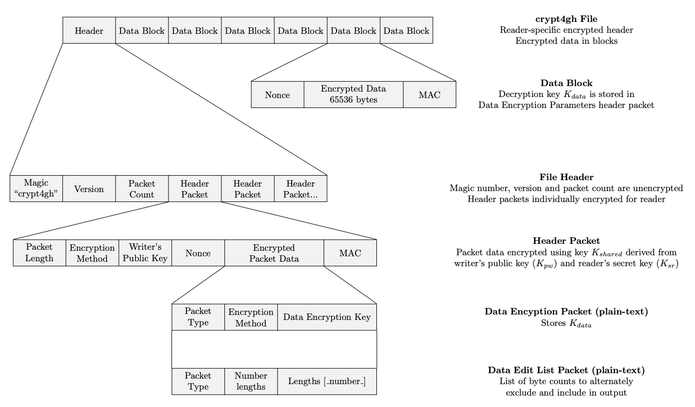

Encryption
==========

The secure data archive uses public key cryptography extensively for
maintaining data privacy throughout the various stages.

-   Files uploaded to the secure data archive are pre-encrypted (on the
    user side) with public key based Cryptography (this is in addition to
    any transport encryption provided for the connection, e.g. TLS or
    the encryption provided by SSH for the SFTP inbox service).
-   During the ingestion process, the files are decrypted and checksum is computed;
-   Finally, if the data is requested, it is again decrypted and
    possibly re-encrypted with a suitable key for the user (again, in addition to any transport encryption).

Files submitted should be in the `Crypt4GH` file format, which provides the
ability to decrypt parts of encrypted files without having to start
decrypting all data up to the desired area (useful for e.g. streaming).

The details of the file format used are provided at
[Crypt4GH file format](http://samtools.github.io/hts-specs/crypt4gh.pdf), and summarized below.

A random session key (of 256 bits) is generated to seed a ChaCha20
engine, with Poly1305 authentication mode. For each segment of at most
64kB of data, a nonce is randomly generated and prepended to the
segment. Using the latter two, the original file is segmented and each segment is encrypted.

The header is prepended to the encrypted data, it also contains, the
word `crypt4gh`, the format version, the number of header packets, and
the sequence of header packets.

A header packet consists of length followed by its content. The content
can be a data encryption packet or an edit list packet.

All header packets are encrypted using an elliptic curve based key
algorithm (X25519 chacha20 ietf poly1305).

The advantages of the format are, among others:

-   Re-encrypting the file for another user requires only to decrypt the
    header and encrypt it with the user's public key.
-   Header packets can be encrypted for multiple recipients.
-   Re-arranging the file to chunk a portion requires only to decrypt
    the header, re-encrypt with an edit list, and select the cipher
    segments surrounding the portion. The file itself is not decrypted
    and re-encrypted.

For encrypting files using this standard, the following tools are recommended:

-   <https://github.com/samtools/htslib-crypt4gh/> - samtools extension
-   <https://github.com/EGA-archive/crypt4gh> - python library
    (recommned to be used with Openssl 1.1.+)
-   <https://github.com/elixir-oslo/crypt4gh> - golang library
-   <https://github.com/uio-bmi/crypt4gh> - Java library
-   <https://github.com/CSCfi/crypt4gh-gui> - GUI using the python
    library
