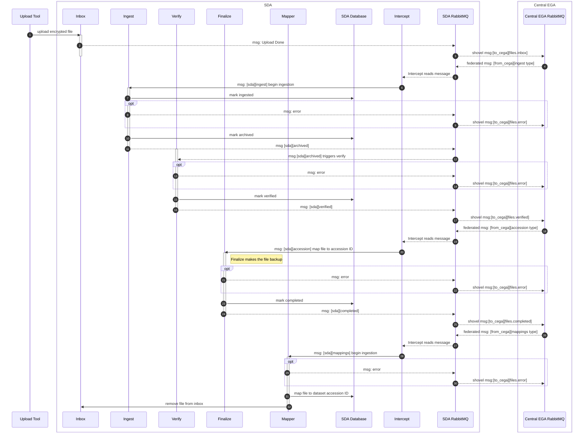

Data Submission
===============

Ingestion Procedure
-------------------

For a given `FederatedEGA` node, `CentralEGA` selects the associated `vhost` and
drops, in the `files` queue, one message per file to ingest.

Structure of the message and its contents are described in
[Message Format](connection.md#message-format).

> NOTE:
> Source code repository for Submission components is available at:
> <https://github.com/neicnordic/sensitive-data-archive>

### Ingestion Workflow

> NOTE:
> Ingestion Workflow Legend
>
> The sequence diagram describes the different phases during the ingestion
> process. The elements at the top represent each of the services or
> actuators involved in the workflow. The interaction between these is
> depicted by horizontal arrows connecting the elements.
>
> The vertical axis represents time progression down the page, where
> processes are marked with colored vertical bars. The colors used for the
> services/actuators match those used for the events initiated by the
> respective services, except for the interactions in case of errors,
> which are highlighted with red. The optional fragments are only executed
> if errors occur in `ingest`, `verify` or `finalize` services. 
> **Note that the time axis in this diagram is all about the sequence of events not duration.**

### Ingestion Steps

The `Ingest` service (can be replicated) reads file from the
`Submission Inbox` and splits Crypt4GH header from the beginning of the
file, puts it in a database and sends the remainder to the `Archive`,
leveraging the Crypt4GH format.

> NOTE:
> There is no decryption key retrieved during that step. The `Archive` can
> be either a regular file system on disk, or an S3 object storage.
> `Submission Inbox` can also have as a backend a regular file system or
> S3 object storage.

The files are read chunk by chunk in order to bound the memory usage.
After completion, a message is dropped into the local message broker to
signal that the `Verify` service can check the file corresponds to what
was submitted. It also ensures that the stored file is decryptable and
that the integrated checksum is valid.

At this stage, the associated decryption key is retrieved. If decryption
completes and the checksum is valid, a message of completion is sent to
`CentralEGA`: Ingestion completed.

> **Important**
> If a file disappears or is overwritten in the inbox before ingestion is completed, ingestion may not be possible.

If any of the above steps generates an error, we exit the workflow and
log the error. In case the error is related to a misuse from the user,
such as submitting the wrong checksum or tampering with the encrypted
file, the error is forwarded to `CentralEGA` in order to be displayed in
the Submission Interface.

Submission Inbox
----------------

`CentralEGA` contains a database of users, with IDs and passwords. We
have developed several solutions allowing user authentication against
CentralEGA user database:

- [Apache Mina Inbox](submission.md##sftp-inbox);
- [S3 Proxy Inbox](submission.md#s3-proxy-inbox);
- [TSD File API](submission.md#tsd-file-api).

Each solution uses CentralEGA's user IDs, but will also be extended to
use Elixir IDs (of which we strip the `@elixir-europe.org` suffix).

The procedure is as follows: the inbox is started without any created
user. When a user wants to log into the inbox (via `sftp`, `s3` or
`https`), the inbox service looks up the username in a local queries the
CentralEGA REST endpoint. Upon return, we store the user credentials in
the local cache and create the user's home directory. The user now gets
logged in if the password or public key authentication succeeds.



> NOTE:
> Sources are located at the separate repository:
> <https://github.com/neicnordic/sensitive-data-archive/tree/main/sda-sftp-inbox> Essentially, it's a
> Spring-based Maven project, integrated with the
> [Local Message Broker](connection.md#local-message-broker).

### TSD File API

In order to utilise Tryggve2 SDA within
[TSD](https://www.uio.no/english/services/it/research/sensitive-data/)
Several components have been developed:

-   <https://github.com/unioslo/tsd-file-api>
-   <https://github.com/uio-bmi/LocalEGA-TSD-proxy>
-   <https://github.com/unioslo/tsd-api-client>

>NOTE:
> Access is restricted to UiO network. Please, contact TSD support for the
> access, if needed. Documentation:
> <https://test.api.tsd.usit.no/v1/docs/tsd-api-integration.html>

### S3 Proxy Inbox

> NOTE:
> Sources are located at the separate repository:
> <https://github.com/neicnordic/sensitive-data-archive/blob/main/sda/cmd/s3inbox/>

The S3 Proxy uses access tokens as the main authentication mechanism.

The sda authentication service
(<https://github.com/neicnordic/sensitive-data-archive/tree/main/sda-auth>) is designed to convert CEGA
REST endpoint authentication to a JWT that can be used when uploading to
the S3 proxy.

The proxy requires the user to set the bucket name the same as the
username when uploading data,
`s3cmd put FILE s3://USER_NAME/path/to/file`


